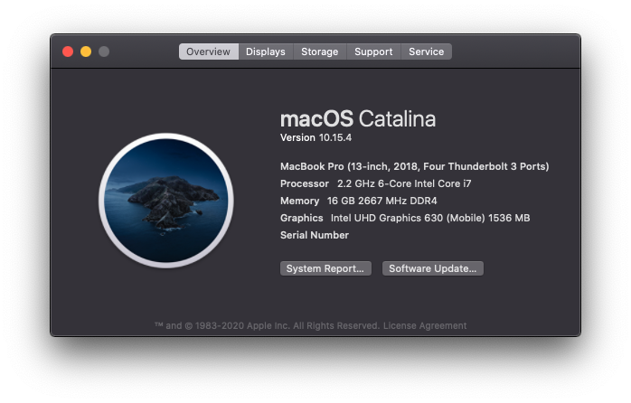

# Hackintosh MSI GS65 8SE OpenCore

This repo contains files to run macOS 10.16.0 (macOS 11.0 Big Sur) using Acidanthera's OpenCore bootloader.

This is still in development so beware of bugs.

#### For Wi-Fi I am using intel wireless card with `AirportItlwm.kext` from [OpenIntelWireless](https://github.com/OpenIntelWireless/itlwm/releases). Feel free to use that or `itlwm.kext` in conjunction with `HeliPort.app` from the same developers.

#### Make sure you use [Dortania](https://dortania.github.io/OpenCore-Install-Guide/) to generate `System UUID`, `SystemSerialNumber`, and `MLB` for iMessage to work in `config.plist`.

### Screenshot
